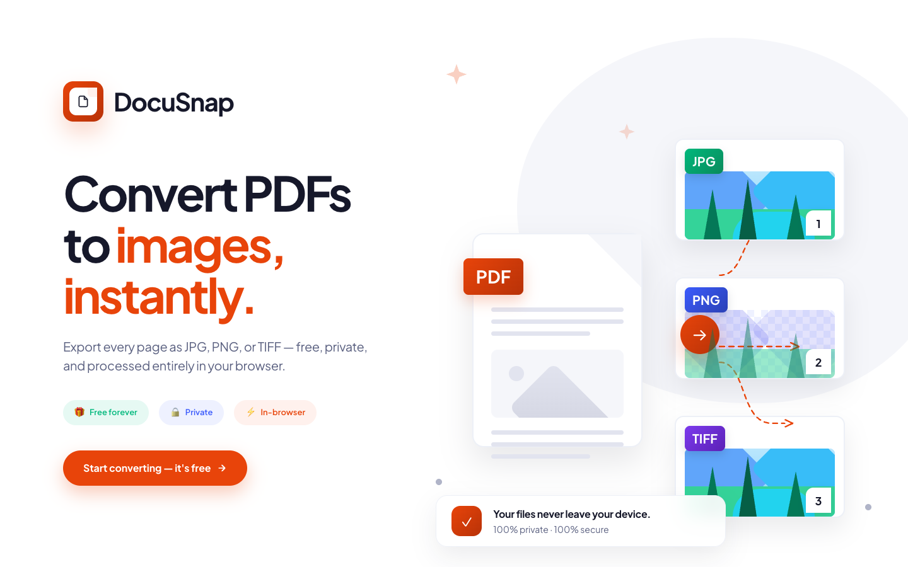

# DocuSnap 📄→🖼️

**Convert PDF pages to images — free, private, and 100% in your browser.**

No uploads. No servers. No limits. Every conversion happens locally on your device.

🔗 **[Live Demo → app-mu-olive-43.vercel.app](https://app-mu-olive-43.vercel.app)**



---

## ✨ Features

<table>
<tr>
<td width="50%" valign="top">

### 📤 Input
- Drop **any PDF** — single or batch
- **Password-protected** files? Just unlock on the spot
- Drag-and-drop or click to browse

### 🎨 Output Formats
- `JPG` — smaller files, perfect for photos
- `PNG` — lossless, sharp text, transparency support
- `TIFF` — archival & print quality with LZW/ZIP compression

### 🖼️ Resolution & Scale
- **72 · 150 · 300 · 600 DPI** — from web to print-ready
- 1× · 2× · 3× output scale
- JPG quality slider (60–100%)

</td>
<td width="50%" valign="top">

### 📋 Page Control
- Select **all · odd · even** pages instantly
- Custom range input → `1-3, 6, 10-12`
- Visual thumbnail grid with lazy loading

### 🛠️ Advanced Processing
- 🌈 **Color mode** — RGB, Grayscale, or pure B&W
- 🔄 **Rotation** — original or force 0° / 90° / 180° / 270°
- 🎨 **Background** — white, black, transparent, or custom hex
- ✂️ **Crop margins** — auto-trim surrounding whitespace
- ↔️ **Resize** — set exact px dimensions, lock aspect ratio
- 🔍 **OCR enhancements** — contrast boost, sharpen, noise removal

### 💾 Export
- **ZIP** download with organized subfolders per PDF
- **Individual** file download (up to 10 files)
- Custom filename patterns → `{pdf-name}-page-{001}.jpg`

</td>
</tr>
</table>

---

## 🚀 Getting Started

```bash
# Clone the repo
git clone https://github.com/Takahayaa/docusnap.git
cd docusnap

# Install dependencies
npm install

# Start the dev server
npm run dev
```

Open [http://localhost:5173](http://localhost:5173) in your browser.

---

## 🏗️ Tech Stack

| Layer | Library |
|---|---|
| Framework | React 18 + Vite |
| PDF rendering | [pdfjs-dist](https://github.com/mozilla/pdf.js) |
| TIFF encoding | [utif2](https://github.com/photopea/UTIF.js) |
| ZIP creation | [JSZip](https://stuk.github.io/jszip/) + [file-saver](https://github.com/eligrey/FileSaver.js) |
| Styling | Tailwind CSS v3 |
| Font | Plus Jakarta Sans |

---

## 🏛️ Project Structure

```
src/
├── components/
│   ├── Hero.jsx              # Landing page illustration
│   ├── upload/               # DropZone, FileCard (password support)
│   ├── pages/                # Thumbnails, selection bar, range input
│   ├── settings/             # Format, quality, background, rotation…
│   └── export/               # Convert button, progress, download area
├── hooks/
│   ├── usePdfFiles.js        # Upload state & PDF.js loading
│   ├── usePageSelection.js   # Per-PDF page selection logic
│   ├── useConversionSettings.js
│   └── useConvert.js         # Conversion pipeline orchestrator
└── utils/
    ├── pdfLoader.js          # PDF.js worker init
    ├── pageRenderer.js       # Canvas rendering at target DPI
    ├── imageExporter.js      # JPG / PNG / TIFF blob export
    ├── imageProcessor.js     # Color mode, crop, OCR enhancements
    ├── zipBuilder.js         # JSZip packaging
    ├── fileNaming.js         # Pattern → filename resolution
    └── pageParser.js         # "1-3, 6, 10-12" → [1,2,3,6,10,11,12]
```

---

## 🔒 Privacy

All processing runs entirely in your browser using the Canvas API and Web Workers. **No files are ever sent to a server.** There is no backend.

---

## 🛠️ Build for production

```bash
npm run build
```

Output goes to `dist/` — deploy to any static host (Vercel, Netlify, GitHub Pages, etc.).

---

## 📬 Author

Made by **Shrey** ❤️

- X / Twitter: [@shr3ys](https://x.com/shr3ys)
- GitHub: [@Takahayaa](https://github.com/Takahayaa)

---

## 📄 License

MIT
